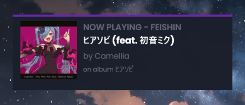

# Feishin Bridge
[](https://github.com/br0k3x/feishin-bridge/actions/workflows/node.js.yml)
This project has been discontinued after I found out Rainmeter could do WebSockets. 💔  
You may use this for projects that can't use WebSockets though, this has most or all of the data.  
An API that communicates with Feishin's Remote server (togglable in Settings > Advanced)  
The username and password of the remote server should be blank.  
Icon from iiPythonx's Feishin fork ([check it out, it's really good!](https://github.com/iiPythonx/feishin))

A Rainmeter skin is provided to display the current song!
## How to set-up

**1:** Clone the GitHub repository  
`git clone https://github.com/br0k3x/feishin-bridge/`  
**2:** Use the included Service Manager for Windows to configure 

```
cd feishin-bridge
ServiceManager
```
1. Install the service, 2. Install the Rainmeter skin (optional)
## Usage
The API will usually run at port 3000. Only basic information about the currently playing song is provided, but more will come soon.
## Contributing
Feel free to contribute! Issues can be reported [here](https://github.com/br0k3x/feishin-bridge/issues) and PRs can be viewed [here](https://github.com/br0k3x/feishin-bridge/pulls)
## Rainmeter skin screenshots

  


